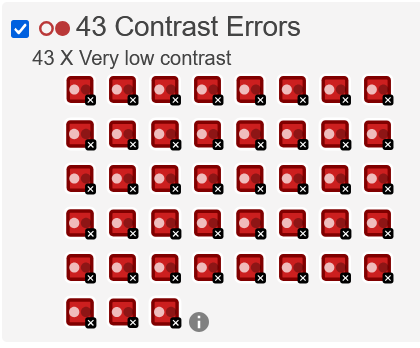
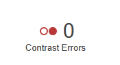

- No JS Frameworks allowed to solve the playgrounds 1-4 (e.g. Vue.js, Angular, React, Svelte,...) - don't panic we will come to that!
- No CSS Libraries allowed (e.g. Bootstrap, Material, Tailwind, ...)

## 3.	Accessibility and Web Component Playground
You might have noticed that the base project has a number of accessibility issues - your task is to explore the existing site and fix them.
Use the tools presented in our accessibility workshop to test the accessibility of your app and write a summary of your reports below.
Additionally, refactor your project by encapsulating the comments section into a web component.

### Tasks
* Accessibility Checks:
  * (2) **Color**: Test the current color contrast (text/background), report the results of the test, and then fix them by changing the assigned colors.
  * (2) **Semantic HTML**: Report on what happens when you try to navigate the page using a screen reader. Fix those navigation issues.
  * (2) **Audio**: The ``<audio>`` player isn't accessible to hearing impaired people — can you add some kind of accessible alternative for these users?
  * (2) **Forms**: 
    * The ``<input>`` element in the search form at the top could do with a label, but we don't want to add a visible text label that would potentially spoil the design and isn't really needed by sighted users. Fix this issue by adding a label that is only accessible to screen readers.
    * The two ``<input>`` elements in the comment form have visible text labels, but they are not unambiguously associated with their labels — how do you achieve this? Note that you'll need to update some of the CSS rule as well.
  * (2) **Comment Section**: The show/hide comment control button is not currently keyboard-accessible. Can you make it keyboard accessible, both in terms of focusing it using the tab key, and activating it using the return key?
  * (4) **The table**: The data table is not currently very accessible — it is hard for screen reader users to associate data rows and columns together, and the table also has no kind of summary to make it clear what it shows. Can you add some features to your HTML to fix this problem?

* (6) Create a web component for the "Add comment" section. Use te shadow DOM and <code>template</code> syntax to encapsulate all related styles inside the component. 

The first task was to add the WAVE extension and open the wbsite. 

### Task 1
The Contrast area had a lot of errors 42 in generla but a light black on green also doen't seem like the best Idea


To fix this a simple fix to the color to soemthing with good contrast and then we accive 0 errors

```css
font[size='7'],
font[size='6'],
font[size='5'] {
  font-family: 'Sonsie One', cursive;
  color: #000;
}

font[size='7'] {
  font-size: 4rem;
  text-align: center;
  color: rgb(19, 10, 10);
  text-shadow: 2px 2px 10px black;
}


div[class='nav'],
article,
footer,
.secondary {
  background-color: rgb(167, 195, 167);
}

```



Comment Section
I also set tabindex="0" on the comments so users can navigate through them using the keyboard. Other than that, nothing unusual.

The Table
To improve accessibility for the table, I added role="table" to the table element and included a caption that’s only read by screen readers. Every <th> now has scope="col", and in each row the first cell was changed to <th scope="row"> for clarity. I also added aria-rowcount="2" to indicate the total number of rows.

### Task 2

I can't navigate to the show comments section. This means there is something wrong with the atribute used for the button

```html 
old:
<div class="show-hide">Show comments</div>

new: 
<button id="show-comments" class="show-hide">Show comments</button>
```


### Task 3
Todo mabey fix that the ogg fle is better used 

```html
<audio controls>
  <source src="media/bear.mp3" type="audio/mp3" />
  <source src="media/bear.ogg" type="audio/ogg" />
  <p>It looks like your browser doesn't support HTML5 audio players.</p>
</audio>

<!-- Accessible alternative for hearing-impaired users -->
<div class="audio-transcript" aria-label="Audio transcript">
  <p><strong>Transcript:</strong></p>
  <p>
    This isn't really an audio fact file about bears, but it is an audio file that you can transcribe.
  </p>
</div>
```

### Task 4

To fix this, we'll replace the text nodes with the proper <label> element and use the for and id attributes to create the required unambiguous association. Since the text labels are already visible, no special screen-reader-only CSS is needed here.

```html
old:
 <form class="comment-form">
              <div class="flex-pair">
                Your name:
                <input
                  type="text"
                  name="name"
                  id="name"
                  placeholder="Enter your name"
                />
              </div>

              <div class="flex-pair">
                Your comment:
                <input
                  type="text"
                  name="comment"
                  id="comment"
                  placeholder="Enter your comment"
                />
              </div>
              <div>
                <input type="submit" value="Submit comment" />
              </div>
            </form> 

new:
          <form class="comment-form">
            <div class="flex-pair">
              <label for="name">Your name:</label>
              <input
                type="text"
                name="name"
                id="name"
                placeholder="Enter your name"
              />
            </div>
            <div class="flex-pair">
              <label for="comment">Your comment:</label>
              <input
                type="text"
                name="comment"
                id="comment"
                placeholder="Enter your comment"
              />
            </div>
            <div>
              <input type="submit" value="Submit comment" />
            </div>
          </form>

```
